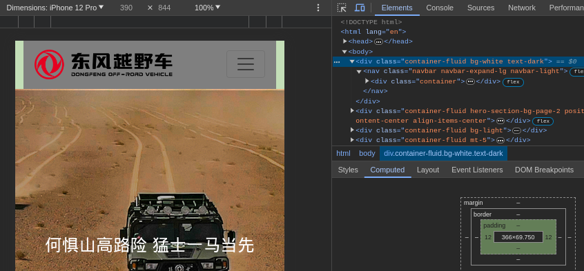
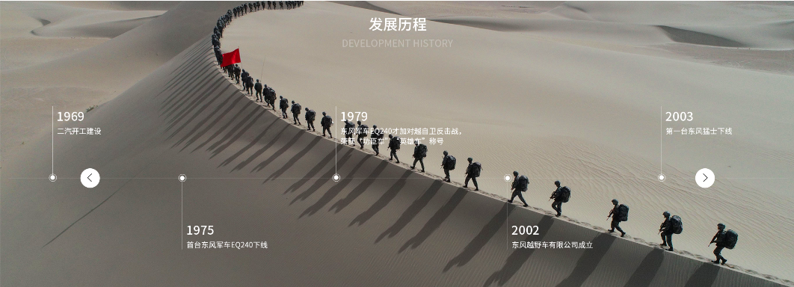

1. On page 2 and page 3, `padding-left` and `padding-right` in `.container-fluid` makes `navbar` look strange. Any solutions?

1. On page 2, is it possible to make this timeline part a slider?

1. On page 4, under navbar is a slider. And can we make the pagination-bullets look like thick slash in the picture?

